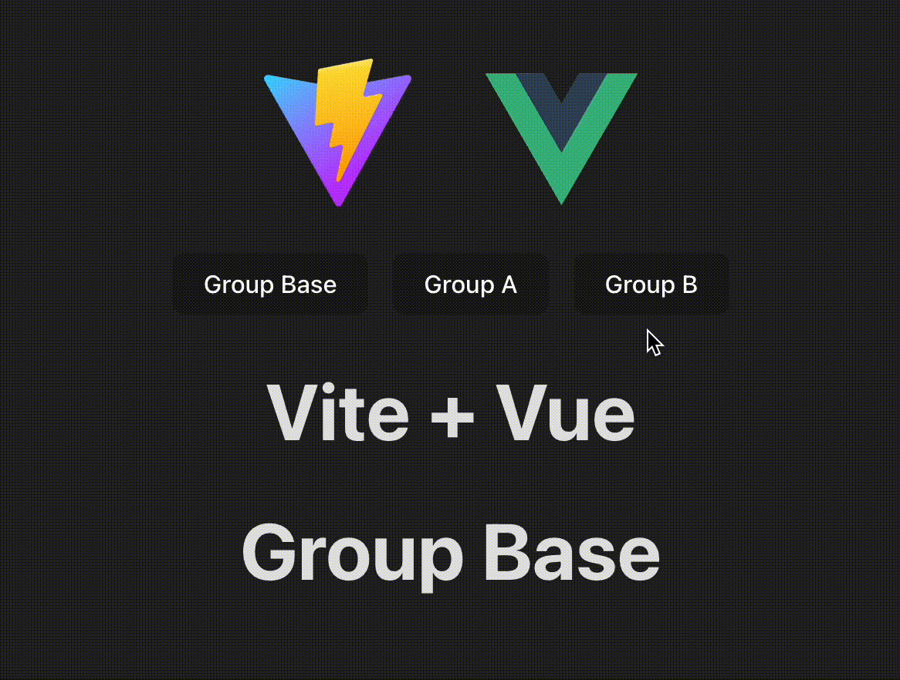

# vue-ab-hoc


## Install

```sh
npm install vue-ab-hoc

yarn add vue-ab-hoc

pnpm install vue-ab-hoc
```

## Quick Start

```ts
// AB.ts
import { defineAsyncComponent } from 'vue';
import { withAbHoc } from 'vue-ab-hoc';

const ComponentBase = defineAsyncComponent(() => import('./ComponentBase'));
const ComponentA = defineAsyncComponent(() => import('./ComponentA'));
const ComponentB = defineAsyncComponent(() => import('./ComponentB'));

export default withAbHoc(ComponentBase, {
    s_a: ComponentA,
    s_b: ComponentB,
});
```

```ts
// main.ts
import { createApp, ref } from 'vue';
import { WithAbHocPlugin } from 'vue-ab-hoc';
import AB from './AB';

const abSigns = ref(['s_a']);

const app = createApp(AB);
app.use(WithAbHocPlugin, abSigns);
app.mount('#app');
```

## Async Component

**Suggest using async component because A/B components just show one in the same time, others may not used most of the time.**

If you want toggle components after async component is loaded, you can use `asyncComponent` in place of `defineAsyncComponent`.

```js
import { abComponent, withAbHoc } from 'vue-ab-hoc';
export default withAbHoc(
    asyncComponent(() => import('./ComponentBase')),
    {
        s_a: asyncComponent(() => import('./ComponentA')),
        s_b: asyncComponent(() => import('./ComponentB')),
    }
);
```

### Both's side effect

defineAsyncComponent


asyncComponent


## Generate a new A/B HOC

If you want a new ab HOC with different sign list, you can use `abHocGenerator` to generate a HOC.

```js
import { ref } from 'vue';
import { abHocGenerator } from 'vue-ab-hoc';

const abSigns = ref([]);
const withAbHoc = abHocGenerator(abSigns);
```
